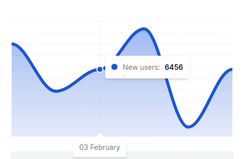

# Apexcharts-rs
[](https://crates.io/crates/apexcharts-rs)
[](https://github.com/clementwanjau/apexcharts-rs/actions/workflows/build.yaml)

This is a Rust WASM bindings for generating charts using the [ApexCharts](https://apexcharts.com/) JavaScript library. The library provides components for creating charts with the `yew` framework. ApexCharts is a modern open source charting library that helps developers to create beautiful and interactive visualizations for web pages.

## Browsers support

| [](http://godban.github.io/browsers-support-badges/)<br/>Firefox | [](http://godban.github.io/browsers-support-badges/)<br/>Chrome | [](http://godban.github.io/browsers-support-badges/)<br/>Safari | [](http://godban.github.io/browsers-support-badges/)<br/> Edge | [](http://godban.github.io/browsers-support-badges/)<br/> IE11 |
| ----------------------------------------------------------------------------------------------------------------------------------------------------------------------------------------------------------------- | ------------------------------------------------------------------------------------------------------------------------------------------------------------------------------------------------------------- | ------------------------------------------------------------------------------------------------------------------------------------------------------------------------------------------------------------- | ------------------------------------------------------------------------------------------------------------------------------------------------------------------------------------------------------ | ------------------------------------------------------------------------------------------------------------------------------------------------------------------------------------------------ |
| 31+ ✔                                                                                                                                                                                                             | 35+ ✔                                                                                                                                                                                                         | 6+ ✔                                                                                                                                                                                                          | Edge ✔                                                                                                                                                                                                 | [(IE11)](#using-it-with-ie11) ✔                                                                                                                                                                  |


## Usage
```toml
[dependencies]
apexcharts-rs = {version="0.1", features=["yew-component"]}
```
and then in your code:

```rust
use yew::prelude::*;
use apexcharts_rs::prelude::{ApexChartComponent, ChartType, ChartSeries, SeriesData};

#[function_component]
fn MyApp() -> Html {
    // This is the data to chart. The data is a vector of `ChartSeries` 
    // which contains the name of the series, the data points, color, type 
    // and z-index. Note that different charts require different data types. 
    let series = vec![
        ChartSeries {
            name: "New users".to_string(),
            data: SeriesData::Single(vec![6500, 6418, 6456, 6526, 6356, 6456]),
            color: "#1A56DB".to_string(),
            r#type: None,
            z_index: None,
        }
    ];
    
    // Options to further configure how the chart looks. Kindly refer to the ApexCharts documentation for more options.
    let raw_options = json!({
      "chart": {
        "fontFamily": "Inter, sans-serif",
        "dropShadow": {
          "enabled": false
        },
        "toolbar": {
          "show": false
        }
      },
      "xaxis": {
        "categories": ["01 February", "02 February", "03 February", "04 February", "05 February", "06 February", "07 February"],
        "labels": {
          "show": false
        },
        "axisBorder": {
          "show": false
        },
        "axisTicks": {
          "show": false
        }
      },
        "yaxis": {
            "show": false
        },
        "legend": {
            "show": false
        },
      "stroke": {
        "width": 6,
        "curve": "smooth"
      },
      "grid": {
        "show": true,
        "strokeDashArray": 4,
        "padding": {
          "left": 2,
          "right": 2,
          "top": 0
        }
      },
      "dataLabels": {
        "enabled": false
      },
      "tooltip": {
        "enabled": true,
        "x": {
          "show": false
        }
      }
    });

    html! {
        <div>
            <ApexChartComponent
                options={raw_options.to_string()}
                r#type={ChartType::Area}
                id={"chart1".to_string()}
                series={series.clone()}
            />
        </div>
    }
}
```


This code will render the following chart:




To combine multiple series in a single chart, you can add more `ChartSeries` to the `series` vector. 

## Currently Supported Charts
- Area Chart
- Line Chart
- Bar Chart
- Column Chart
- Pie Chart
- Donut Chart
- Radial Bar Chart
- Heatmap Chart
- Candlestick Chart
- Radar Chart
- Polar Area Chart
- Bubble Chart
- Scatter Chart
- Treemap Chart
- Box Plot Chart
- Range Bar Chart

## Series Data
The `SeriesData` enum is used to represent the data points for the chart. The data points can be a single value or a tuple of two values. The data points can be represented as follows:
```
use apexcharts_rs::prelude::SeriesData;

let data = SeriesData::Single(vec![6500, 6418, 6456, 6526, 6356, 6456]);

// or 


let data = SeriesData::CategoryPaired(vec![
    ("01 February".to_string(), 6500),
    ("02 February".to_string(), 6418),
    ("03 February".to_string(), 6456),
    ("04 February".to_string(), 6526),
    ("05 February".to_string(), 6356),
    ("06 February".to_string(), 6456),
]);

// or

// Note that this data format should only be used for the Radial Charts 
// like Pie Chart, Donut Chart, and Radial Bar Chart. The sum of the values 
// should be 100.
let data = SeriesData::Radial(vec![
    ("Rent".to_string(), 42.0),
    ("Gas".to_string(), 12.4),
    ("Electricity".to_string(), 8.4),
    ("Food".to_string(), 11.2),
    ("Clothes".to_string(), 9.5),
    ("Entertainment".to_string(), 16.5),
]);
```
Different charts may require different data formats. Kindly refer to the ApexCharts documentation for more information.

For more examples check the [examples](./examples) directory.

## License

This project is licensed under the `Apache License 2.0` and `MIT` license - see the [LICENSE](LICENSE) file for details

